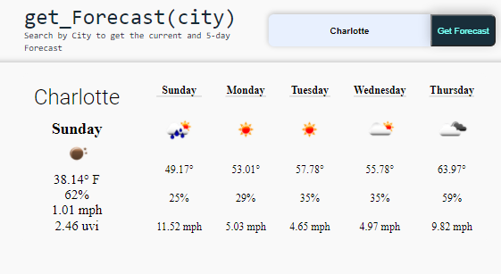

# get_Weather(city)

A simple app using the API [Open Weather Map](https://openweathermap.org/api) to get a Weather Forecast for the current time along with the five-day forecast.

---

## [Enter a city name for current weather and a 5-Day forecast ( link )](https://erikplachta.github.io/get_Weather_arg_City/)

---
## Contact Me

---

## TODOs

- [x] API - Connect to Open Weather Map
- [ ] User Interface
  - [x] Display current conditions with uvi
    - [ ] Color scale to indicate uvi severity
  - [x] Display  5-day forecast
  - [x] Responsive header content
  - [ ] Responsive body content
    - [x] Error message popup if no city found
    - [ ] Content hover effects
- [ ] Local Storage
  - [x] Local storage framework
  - [ ] Local storage to store search history
